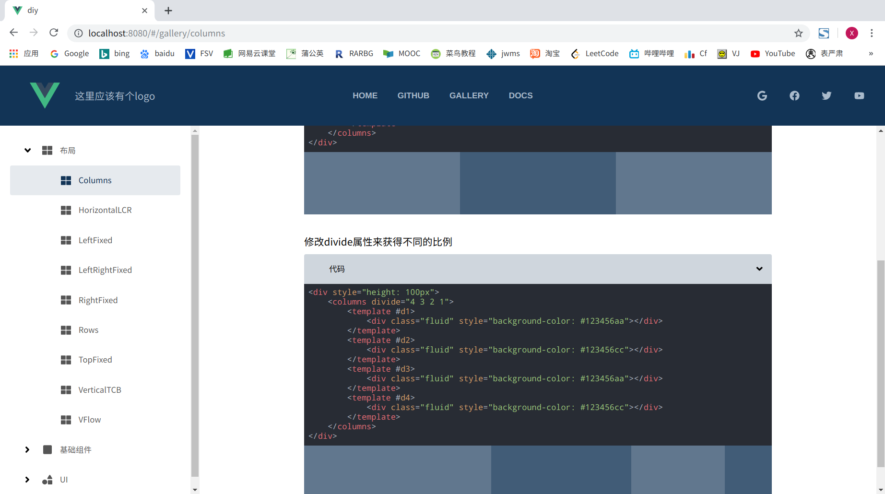
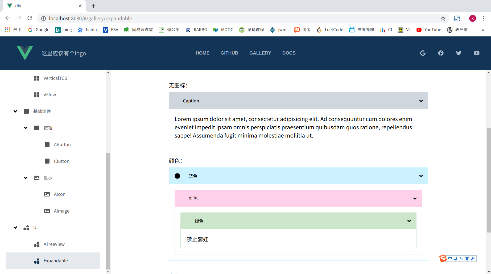
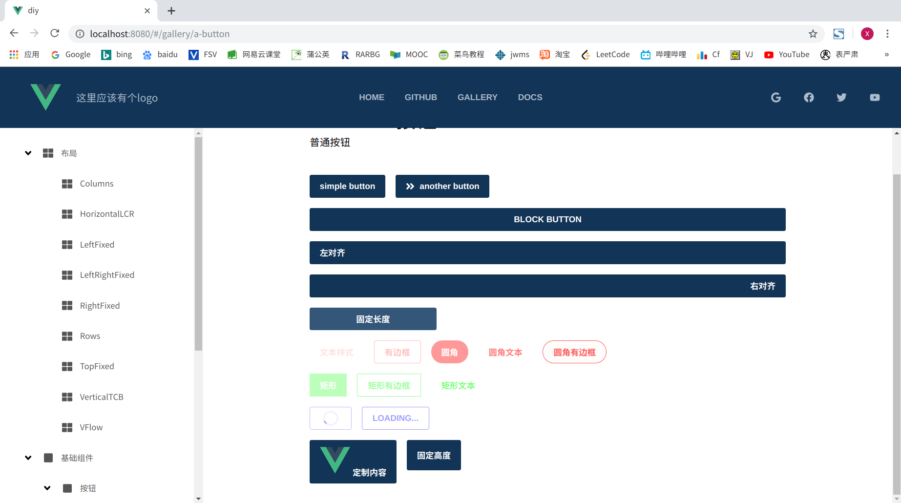

# ivy
#### Vue 布局以及基础组件库
#### a vue layout and basic component lib
#### [web](https://quizzical-villani-ce22c9.netlify.com/#/gallery/)
## Preview



## Project setup
```
npm install
```

### Compiles and hot-reloads for development
```
npm run serve
```

### Compiles and minifies for production
```
npm run build
```

### Lints and fixes files
```
npm run lint
```

### Customize configuration
See [Configuration Reference](https://cli.vuejs.org/config/).
